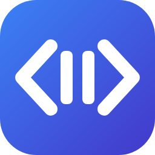
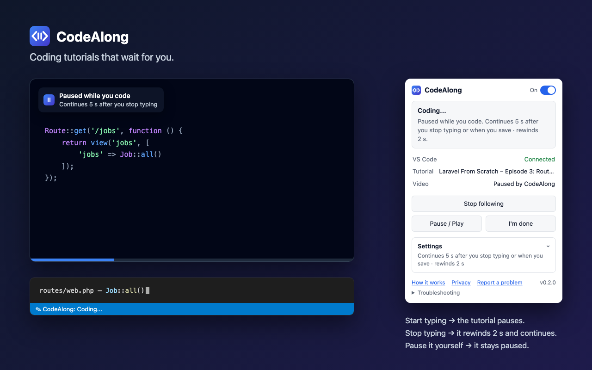
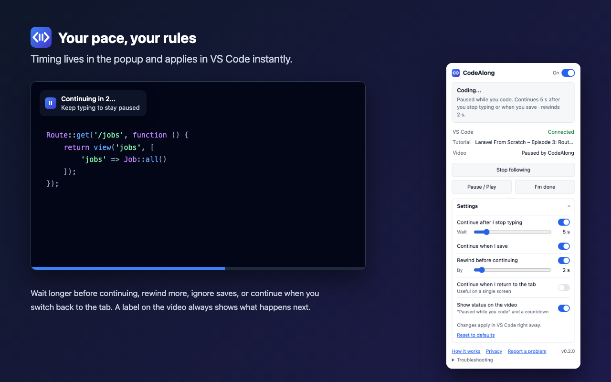

<p align="center">
  
</p>

<h1 align="center">CodeAlong</h1>

<p align="center"><strong>Coding tutorials that wait for you.</strong></p>

<p align="center">
  <a href="https://chromewebstore.google.com/detail/codealong/jhfmljdjpeaclncddhhifegcknjgfjij"></a>
  <a href="https://marketplace.visualstudio.com/items?itemName=SebastianIngebrigtsen.codealong"></a>
  <a href="https://github.com/sebastianingebrigtsen/codealong/actions/workflows/ci.yml"></a>
  <a href="LICENSE"></a>
</p>

You're following a coding tutorial. The instructor starts typing, so you pause the video, switch to
your editor, type, switch back, press play… and repeat that a hundred times.

**CodeAlong does the pausing for you.** Start typing in VS Code and the tutorial in Chrome pauses.
Stop typing, and it rewinds two seconds and continues. You keep your eyes on the code and your hands
on the keyboard.



## Install

CodeAlong has two small parts that work together. Install both:

1. **[CodeAlong for Chrome](https://chromewebstore.google.com/detail/codealong/jhfmljdjpeaclncddhhifegcknjgfjij)**: finds the video and pauses or plays it.
2. **[CodeAlong for VS Code](https://marketplace.visualstudio.com/items?itemName=SebastianIngebrigtsen.codealong)**: notices _that_ you are coding (never _what_).

They find each other automatically. There is nothing to configure, no account and no cloud.

## Getting started

1. Open a coding tutorial in Chrome.
2. Click the **CodeAlong** icon in the toolbar (pin it via the puzzle-piece menu) and choose
   **Follow this tab**.
3. Start the video and code along in VS Code.

The toolbar icon shows **ON** when Chrome and VS Code are connected. While the video is paused, a
small label on it shows why and counts down before it continues. The VS Code status bar shows the
same: **CodeAlong: Tutorial Playing**, **CodeAlong: Coding... (resume in 3s)** and so on.

### When does it pause and continue?

| When you…                                             | CodeAlong…                                     |
| ----------------------------------------------------- | ---------------------------------------------- |
| start typing in VS Code while the tutorial plays      | pauses it                                      |
| stop typing for 5 seconds                             | rewinds 2 seconds and continues                |
| save the file (Ctrl+S / Cmd+S)                        | continues about a second later                 |
| pause the video yourself                              | **never** starts it again on its own           |
| press play while you're still typing                  | lets it play until you stop                    |
| scrub through the video while CodeAlong has it paused | waits, and doesn't rewind your chosen position |

All of these timings can be changed.

## Settings

Click the CodeAlong icon in Chrome and open **Settings**. Changes apply in VS Code right away.



| Setting                           | Default       | What it does                                                        |
| --------------------------------- | ------------- | ------------------------------------------------------------------- |
| Automatic pausing (header switch) | on            | Turn CodeAlong off for a while. The shortcuts keep working.         |
| Continue after I stop typing      | on, after 5 s | How long CodeAlong waits after your last keystroke (1–30 s).        |
| Continue when I save              | on            | A manual save counts as "done". Auto save is ignored.               |
| Rewind before continuing          | on, by 2 s    | So you hear the end of the instructor's sentence again (1–15 s).    |
| Continue when I return to the tab | off           | Handy on a single screen: switching back to the video continues it. |
| Show status on the video          | on            | The "Paused while you code" label and countdown on the video.       |

**Reset to defaults** is at the bottom of the section. In VS Code, click **CodeAlong** in the status
bar to turn automatic pausing on or off from the editor. The only VS Code setting is
`codealong.debugLogging`, for troubleshooting.

### Keyboard shortcuts

| Action                     | VS Code                    | Chrome        |
| -------------------------- | -------------------------- | ------------- |
| Pause or play the tutorial | `Ctrl+Alt+P` (macOS `⌃⌥P`) | `Alt+Shift+P` |
| I'm done, continue now     | `Ctrl+Alt+D` (macOS `⌃⌥D`) | `Alt+Shift+D` |

Change them in VS Code under _Keyboard Shortcuts_ and in Chrome at `chrome://extensions/shortcuts`.

## Supported platforms

|                       |                                                                                                                                                                          |
| --------------------- | ------------------------------------------------------------------------------------------------------------------------------------------------------------------------ |
| **Browser**           | Google Chrome 116+                                                                                                                                                       |
| **Editor**            | Visual Studio Code 1.95 or newer. Automatically tested on 1.95.3 (the minimum) and 1.140.0, plus a weekly check against the latest stable release.                       |
| **Video sites**       | YouTube and Laracasts (verified). Any site with a standard HTML5 video player, including players in iframes (e.g. Vimeo embeds) and web components with open shadow DOM. |
| **Operating systems** | macOS: verified by hand and in automated tests. Windows and Linux: unit and integration tests run in CI; not yet verified by hand.                                       |

Other Chromium browsers (Edge, Brave, Arc) and VS Code forks (Cursor, VSCodium) may work but are not
tested. Firefox, Safari and other editors are not supported.

## Privacy

CodeAlong runs entirely on your computer. The VS Code extension tells the Chrome extension only
_that_ you typed or saved, never _what_. It doesn't read, store or transmit your code, it doesn't
record keystrokes, and it has no analytics or remote servers. The two extensions talk over a local
connection (`127.0.0.1`) that websites cannot use. Your settings are stored locally in Chrome.

[Privacy policy](https://sebastianingebrigtsen.github.io/codealong/PRIVACY.html) · [Security](SECURITY.md)

## Known limitations

- Videos must use a standard HTML5 `<video>` element. Players that draw into a canvas or hide the
  video in a _closed_ shadow root are not detected.
- On sites other than YouTube, Vimeo and Laracasts, Chrome asks for permission once per site. A
  video in a cross-origin iframe on such a site (other than a YouTube or Vimeo embed) is not detected.
- "Done" is a guess. If you pause to think for longer than the idle delay, the video continues.
  Raise the delay, or turn off "Continue after I stop typing" and continue by saving or with the
  shortcut.
- Typing in any file counts; CodeAlong doesn't know which files belong to the tutorial.
- The Chrome shortcuts only work while Chrome has focus. Use the VS Code shortcuts while coding.
- While the integrated terminal has focus, VS Code passes the shortcuts to the shell instead.

## How it works

```
Chrome extension             local connection (127.0.0.1)            VS Code extension
finds & controls the video   ◄────── typing / save signals ───────   notices that you code,
knows who paused it          ─────── video state, settings ──────►   decides when to pause/play
stores your settings
```

The VS Code extension holds a small state machine that decides _when_ to pause and play. The Chrome
extension knows _who_ paused the video, refuses to resume anything the user paused, and owns the
settings. Read [docs/ARCHITECTURE.md](docs/ARCHITECTURE.md) for the details and the invariants.

## Contributing

Bug reports, ideas and pull requests are welcome. See [CONTRIBUTING.md](CONTRIBUTING.md).

```bash
git clone https://github.com/sebastianingebrigtsen/codealong.git
cd codealong
npm install
npm run dev        # builds both extensions and rebuilds on change
```

Load `packages/chrome/dist` as an unpacked extension in Chrome (_Developer mode_ on
`chrome://extensions`), and press F5 in VS Code to run the editor extension. `npm run check` runs
formatting, lint, typecheck, tests and the build.

## Roadmap

CodeAlong is young (0.x) and deliberately small. Under consideration, not promised:

- Verified support for more video sites and Chromium-based browsers
- Only counting typing inside the tutorial's project folder
- Manual verification on Windows and Linux

Have an idea? [Open a feature request](https://github.com/sebastianingebrigtsen/codealong/issues/new/choose).

## License

[MIT](LICENSE) © Sebastian Westin Ingebrigtsen
